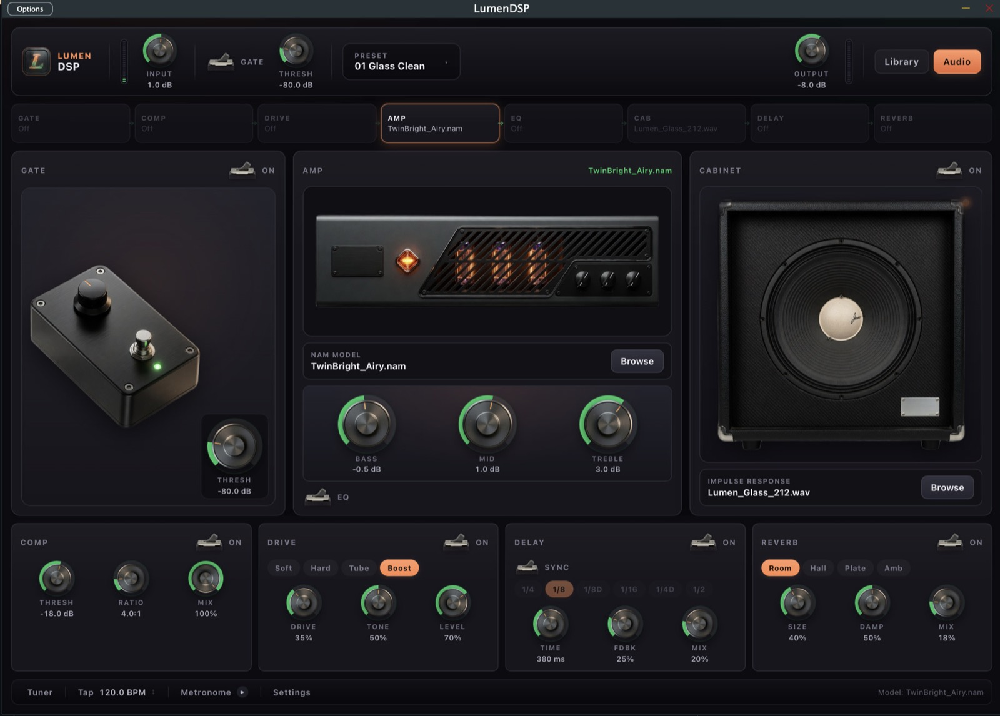

# LumenDSP

**LumenDSP** is a free, open-source desktop amplifier modeler for guitarists. Load any Neural Amp Modeler (`.nam`) capture and play through it in real time, with a premium standalone experience inspired by Neural DSP Archetype plugins—focused on modern fusion tones in the spirit of Mateus Asato and Jack Gardiner.



<!-- BEGIN_LATEST_RELEASE -->
## Download

[](https://github.com/Kripu77/LumenDSP/releases/tag/v0.2.0)

**Current release: [`v0.2.0`](https://github.com/Kripu77/LumenDSP/releases/tag/v0.2.0)**

| Platform | Download |
|----------|----------|
| **macOS** (Apple Silicon) | [**LumenDSP-macos-arm64.zip**](https://github.com/Kripu77/LumenDSP/releases/download/v0.2.0/LumenDSP-macos-arm64.zip) |
| **Windows** (x64) | [**LumenDSP-windows-x64.zip**](https://github.com/Kripu77/LumenDSP/releases/download/v0.2.0/LumenDSP-windows-x64.zip) |

Versioned filenames: [macOS v0.2.0](https://github.com/Kripu77/LumenDSP/releases/download/v0.2.0/LumenDSP-v0.2.0-macos-arm64.zip) · [Windows v0.2.0](https://github.com/Kripu77/LumenDSP/releases/download/v0.2.0/LumenDSP-v0.2.0-windows-x64.zip)

Always-latest redirect (after this release is published): [all releases](https://github.com/Kripu77/LumenDSP/releases/latest)

**Install notes**
- **macOS:** unzip → open `LumenDSP.app` (right-click → **Open** if Gatekeeper warns). Optional: copy `LumenDSP.vst3` to `~/Library/Audio/Plug-Ins/VST3/`.
- **Windows:** unzip → run `LumenDSP.exe` (keep `FactoryContent/` and `web/` next to the exe).
- Builds are not notarized. Allow Microphone / Bluetooth when prompted so audio devices appear.

All releases: https://github.com/Kripu77/LumenDSP/releases
<!-- END_LATEST_RELEASE -->

## Tone target

LumenDSP is built around a clear fusion-oriented voice:

- Glassy clean-to-light-crunch character
- Strong pick-attack clarity
- Smooth, compressed sustain on leads
- Tight low end

The core tone always comes from **your** `.nam` file. LumenDSP does not replace the capture—it gives you a clean signal path, cab IR loading, and a restrained control set around it.

## Features

| Area | Capability |
|------|------------|
| Amp | Load and hot-swap `.nam` / A2 models via NeuralAmpModelerCore |
| Cab | Load and hot-swap impulse response `.wav` files |
| Library | Browse factory + user NAM/IR library with favorites and import |
| Dynamics | Input gain, output level, noise gate, compressor |
| Drive | Soft-clip overdrive pedal stage (pre-amp) |
| Tone | Three-band EQ (post-amp, pre-cab) |
| Time FX | Delay and reverb (post-cab) |
| Practice | Tuner + metronome (bottom dock) |
| Presets | Named presets with categories, tags, favorites, import/export |
| Formats | Standalone desktop app and VST3 plugin |
| UI | WebView frontend (HTML/CSS/JS) with dense dark rack layout, JSON bridge to C++ engine |

### Signal flow

```
Input → Gate → Comp → Drive → Amp (NAM) → EQ → Cab (IR) → Delay → Reverb → Output
```

## Status

| Milestone | State |
|-----------|-------|
| 1. Repository setup and README | Complete |
| 2. Audio engine core (NAM load + real-time process) | Complete |
| 3. JUCE standalone with audio device selection | Complete |
| 4. UI foundation (LookAndFeel + core controls) | Complete |
| 5. Model / IR hot-swap loading | Complete |
| 6. Preset system | Complete |
| 7. Polish (layout, signal flow, metering, micro-interactions) | Complete |

## Stack

- **JUCE** (8.x default) — application framework, audio I/O, VST3, UI  
  CMake uses the same `juce_add_plugin` workflow as JUCE 7. The default tag is **8.0.6** because JUCE 7.0.x fails to build `juceaide` against the **macOS 15 SDK** (`CGWindowListCreateImage` removed). Override with `-DLUMENDSP_JUCE_GIT_TAG=...` if you use an older SDK.
- **CMake** — cross-platform build and dependency fetch
- **[NeuralAmpModelerCore](https://github.com/sdatkinson/NeuralAmpModelerCore)** — real-time `.nam` / A2 inference (MIT)

## Build requirements

- CMake 3.24 or newer
- C++20 compiler (Xcode 14+, MSVC 2022, or recent GCC/Clang)
- Git (JUCE and NeuralAmpModelerCore are fetched at configure time)
- On macOS: Xcode command-line tools
- On Windows: Visual Studio 2022 with C++ desktop workload
- On Linux: standard audio/dev packages (`libasound2-dev`, `libfreetype6-dev`, `libx11-dev`, `libxrandr-dev`, `libxinerama-dev`, `libxcursor-dev`, `libcurl4-openssl-dev`, etc.)

VST3 support is provided through JUCE; no separate Steinberg SDK install is required for building.

## Build instructions

### Quick build and run

From the repo root, use `build-and-start.sh` to configure (if needed), build the Release standalone, sync the WebView UI into the app bundle, and open it:

```bash
git clone https://github.com/Kripu77/LumenDSP.git
cd LumenDSP

./build-and-start.sh
```

Useful flags:

| Flag | Effect |
|------|--------|
| `--clean` | Wipe `build/` then reconfigure and rebuild |
| `--build-only` | Build without launching |
| `--open-only` | Launch the last build without compiling |
| `-j N` | Parallel jobs (default: CPU count) |
| `--debug` | Debug build |
| `--vst3` | Build standalone + VST3 (`LumenDSP_All`) |
| `--configure` | Force CMake reconfigure |
| `--help` | Full option list |

First configure downloads JUCE and NeuralAmpModelerCore (including Eigen). That step can take several minutes.

### Manual CMake

```bash
cmake -B build -DCMAKE_BUILD_TYPE=Release
cmake --build build --config Release -j
```

### Outputs

After a successful build (paths may vary by platform/generator):

| Format | Typical path |
|--------|----------------|
| Standalone (macOS) | `build/LumenDSP_artefacts/Release/Standalone/LumenDSP.app` |
| VST3 (macOS) | `build/LumenDSP_artefacts/Release/VST3/LumenDSP.vst3` |
| Standalone (Linux) | `build/LumenDSP_artefacts/Release/Standalone/LumenDSP` |
| VST3 (Linux) | `build/LumenDSP_artefacts/Release/VST3/LumenDSP.vst3` |
| Standalone (Windows) | `build/LumenDSP_artefacts/Release/Standalone/LumenDSP.exe` |
| VST3 (Windows) | `build/LumenDSP_artefacts/Release/VST3/LumenDSP.vst3` |

Install the VST3 by copying it into:

- macOS: `~/Library/Audio/Plug-Ins/VST3/`
- Windows: `C:\Program Files\Common Files\VST3\`
- Linux: `~/.vst3/`

### Optional configure flags

```bash
cmake -B build \
  -DCMAKE_BUILD_TYPE=Release \
  -DLUMENDSP_COPY_PLUGIN_AFTER_BUILD=ON \
  -DLUMENDSP_JUCE_GIT_TAG=8.0.6 \
  -DLUMENDSP_NAM_GIT_TAG=v0.5.4
```

## Usage (zero-config)

**New users:** open the app, set audio devices, and play. Factory fusion tones install automatically.

1. Launch the standalone app (or load the VST3 in your DAW).
2. **Standalone:** click **Audio** and choose your guitar **input** and speaker/headphone **output**.
3. Play — **01 Glass Clean** loads by default (Twin-style glassy clean + glass cab IR).
4. Switch factory presets (Clean / Lead / Crunch / Ambient) — each uses the full FX rack.
5. Optional: drop your own `.nam` / `.wav` IR, tweak knobs, **Save** a preset.

Step-by-step: **[QUICKSTART.md](QUICKSTART.md)**

### Factory pack (bundled)

| Preset | Model | Cab IR | Character |
|--------|--------|--------|-----------|
| 01 Glass Clean | TwinBright_Clean | Lumen_Glass_212 | Soft comp + room |
| 02 Airy Clean | TwinBright_Airy | Lumen_Glass_212 | Light delay + ambient |
| 03 Smooth Lead | Bug333_Clean | Lumen_Smooth_Lead_412 | Tube drive + plate |
| 04 Full Rig Clean | Bug333_CleanCab | cab bypassed | Full-rig capture |
| 05 Light Crunch | JCM2000_Clean | Lumen_Tight_Crunch_112 | Soft drive rhythm |
| 06 Ambient Swell | TwinBright_Airy | Lumen_Smooth_Lead_412 | Long delay + bloom |

Attribution and licenses: `Resources/FactoryContent/ATTRIBUTION.md`.

Installed on first launch to the user data folder (macOS: `~/Library/LumenDSP/`).

### Preset format

Presets are simple XML files (`.lumenpreset`) containing:

- Preset name
- Absolute path to the NAM model
- Absolute path to the IR (optional)
- Full parameter state (gains, toggles, etc.)

## Project layout

```
LumenDSP/
├── CMakeLists.txt
├── build-and-start.sh   # configure, build, sync web UI, launch standalone
├── LICENSE
├── README.md
├── Source/
│   ├── audio/           # NAM engine, IR convolver, gate, EQ, meters, pipeline
│   │   ├── AudioPipeline.*
│   │   ├── NamEngine.*
│   │   ├── IrConvolver.*
│   │   ├── NoiseGate.*
│   │   ├── ThreeBandEq.*
│   │   └── LevelMeter.*
│   ├── parameters/      # Parameter IDs, ranges, layout
│   ├── presets/         # Preset save / recall
│   ├── ui/              # LookAndFeel, knobs, meters, signal flow, slots
│   │   ├── DesignTokens.h
│   │   ├── LumenLookAndFeel.*
│   │   ├── KnobComponent.*
│   │   ├── LedMeterComponent.*
│   │   ├── SignalFlowStrip.*
│   │   ├── FileSlotComponent.*
│   │   └── PresetBarComponent.*
│   ├── PluginProcessor.*
│   └── PluginEditor.*
└── cmake/
```

## Architecture notes

- **Hot-swap:** NAM models and IRs load on a background thread, then swap in on the audio thread with minimal interruption.
- **Pipeline order:** input gain → noise gate → NAM → three-band EQ → cab IR → output level, with input/output peak meters.
- **UI tokens:** accent color, spacing (8px scale), typography, and meter timing live in `Source/ui/DesignTokens.h`.
- **Code style:** C++ sources avoid inline comments; behavior is expressed through naming and structure. Numeric values use named constants.

## Releases (CI / installers)

Prefer the **[Download](#download)** section at the top for the latest installers.

| What | How |
|------|-----|
| Version number | `VERSION` file (semver, e.g. `0.1.0`) |
| Git tag | `v` + version → `v0.1.0` |
| CI builds | Every PR and push to `main` (`.github/workflows/ci.yml`) |
| GitHub Release | Push a version tag (`.github/workflows/release.yml`) |
| README downloads | Release job rewrites the Download block + uploads stable zip names |

```bash
./scripts/bump-version.sh patch   # or minor | major
git add VERSION && git commit -m "chore(release): bump version to $(cat VERSION)"
git push origin main
git tag -a "v$(cat VERSION)" -m "Release v$(cat VERSION)"
git push origin "v$(cat VERSION)"
```

Full rules (semver, pre-releases, auto-tag option): **[RELEASING.md](RELEASING.md)**.

## License

LumenDSP original source code is released under the **MIT License**. See [LICENSE](LICENSE).

Third-party components retain their own licenses:

- [JUCE](https://github.com/juce-framework/JUCE) — see JUCE license terms for your use case
- [NeuralAmpModelerCore](https://github.com/sdatkinson/NeuralAmpModelerCore) — MIT
- Eigen (via NeuralAmpModelerCore) — MPL2

## Credits

- Neural Amp Modeler ecosystem by [Steven Atkinson](https://github.com/sdatkinson) and contributors
- Tone inspiration: modern fusion players such as Mateus Asato and Jack Gardiner
- Visual language: informed by the clarity and polish of Neural DSP Archetype-style interfaces (independent open-source project; not affiliated with Neural DSP)

## Contributing

Issues and pull requests are welcome. Prefer small, focused changes with clear conventional commit messages (`feat:`, `fix:`, `docs:`, `chore:`).
